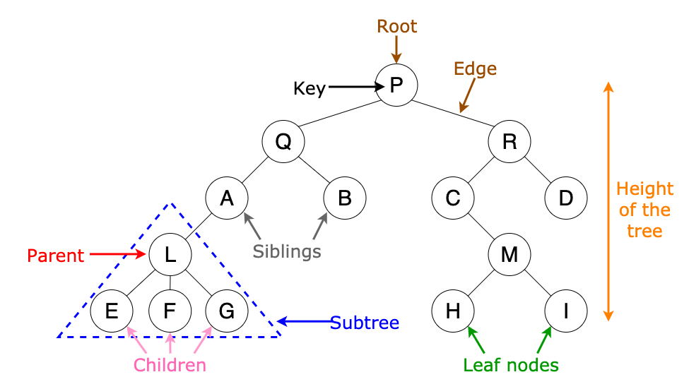

# How to create new pages on the OLED
All the pages are structed as a data tree. Important terms to know are parent, child and root. In our case a parent can have up to 9 children.


## Default setup
Replace "default" by your page name in the code blocks down below.

### .h files
In the .h the following lines should always be present
```c
#include "OLED_driver.h"

void default_page_init(page_struct *parent);
```

### .c files
When creating a new page you start by going to the parents .c file for the setup.
In this file the following code block needs to be added right below the includes
```c
struct page_struct default_page;
```
and adding the following block in the *parent_page_init(page_struct \*parent)* to initialize your page.
```c
pages_set_default_values(&default_page); //Don't change this function name
default_page.id = 0; 
strcpy(default_page.page_name, "Default");
default_page.parent = parent;
add_child_to_parent(&default_page);
default_page_init(&default_page);
```

If you need to display text that is always the same you could add the following as well. The maximum is 4 lines. Do not do this for menus!
```c
strcpy(default_page.line0, "What do you");
strcpy(default_page.line1, "want to say?");
strcpy(default_page.line2, "RoboTeam Twente");
strcpy(default_page.line3, "reads this");
```

Then in default_page.c you can add the following lines
```c
#include "default_page.h"

/**
 * @note lower bound < id < upper bound
 */
void default_page_init(page_struct *parent) {
    //Add the children of your page here
}

```

The id should be an unique number. To ensure this you can go through the following steps:
1. Look at the parents id
2. Get the lower bound (exclusive) by appending a 0 at the end
3. Get the upper bound (exclusive) by adding 1 to the parent id and then appending a 0 at the end

For example:
1. The parent id is 31
2. This means that the lower bound for default_page is 310
3. The upper bound would become 320

Thus the pages in default_page_init should have an id according to the following rule: 310 < id < 320

## Menus
When creating a menu add this line to the lines where you initialize your page.
```c
default_page.is_menu = true;
```

## Self Tests

### General Setup
When creating a self test add tone of these to lines to the lines where you initialize your page
```c
default_page.is_test = BLOCKING_TEST;
```
or
```c
default_page.is_test = NON_BLOCKING_TEST;
```

The difference is that during a blocking test the control loop in robot.c will return early to not run any of the control code. 

During self tests REM messages received from the basestation are ignored.

#### Multiple pages for 1 test
Sometimes it could be useful to have more than 1 page for a test.
For example to display a warning beforehand or the results afterwards. I recommend looking at wheel_twitch.c to see how you could more nicely set this up instead of having to make 2/3 .c/.h files.

### Test Setup
Add the following function to your page, replace "test" by your page name
```c
void test_run() {

}
```
 In selftest_selector.c add the following lines in the switch, before the default.
 ```c
 case your_test_id:
    test_run();
    break;
```

### Blocking test
For blocking tests the following setup is recommended to be put in the test_run() function
```c
start_of_test();
wheels_Unbrake(); //Can be removed if wheels are not used for this test
//Your test code
wheels_Brake(); //Can be removed if wheels are not used for this test
end_of_test();

```

### Non-blocking test
For non-blocking test a little more setup is required.

Under the includes add a variable that keeps track if the test is running.

In the test_run() the following setup is recommended
```c
if(!test_is_running) {
    start_of_test();
    wheels_Unbrake(); //Can be removed if wheels are not used for this test
    test_is_running = true;
} else if (stop_condition) {
    wheels_Brake(); //Can be removed if wheels are not used for this test
    end_of_test();
    test_is_running = false;
} else {
    //Put your instructions here
}
```

## Variable pages
When creating a variable page add this line to the lines where you initialize your page.
```c
default_page.has_variables = true;
```

To your file add the following method where you replace "page" by the name of your page

```c
void page_update(page_struct *page) {
    char temp[MAX_STRING_LENGTH];
    sprintf();
    strcpy(page->line0, temp);
    sprintf();
    strcpy(page->line1, temp);
    sprintf();
    strcpy(page->line2, temp);
    sprintf();
    strcpy(page->line3, temp);
}
```

You can use sprintf() to format your string.

In variable_page_selector.c add the following lines in the switch before the default.
```C
case your_page_id:
    page_update(page);
    break;
```